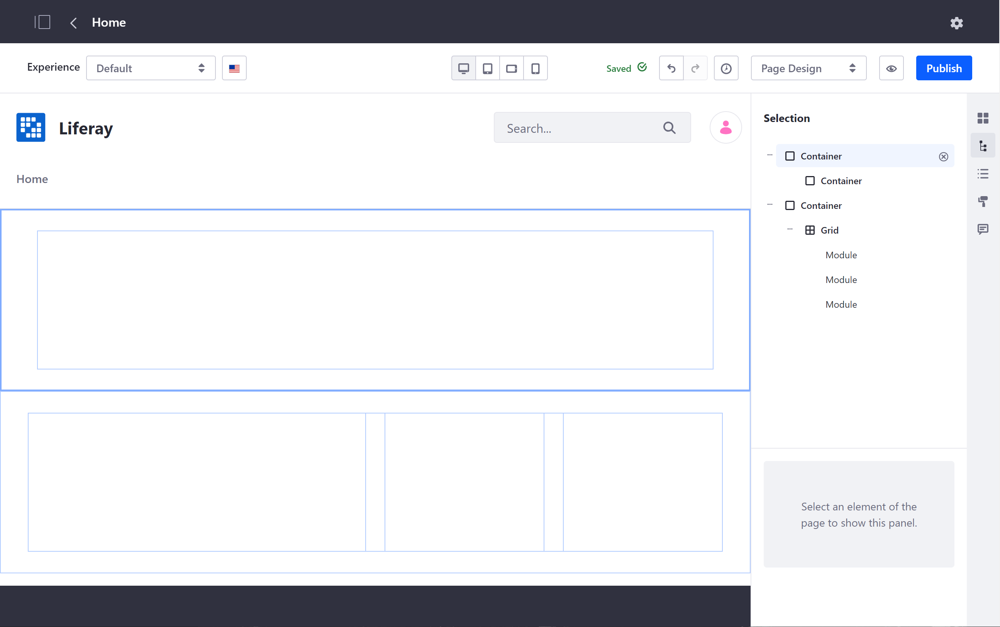
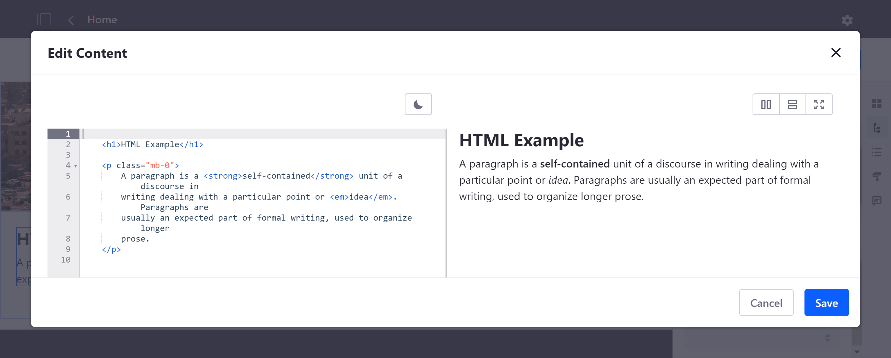
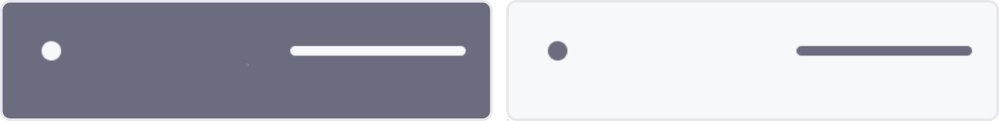

# フラグメントの使用

ページ*フラグメント*は、コンテンツページの主要な構成要素として機能する、拡張可能で再利用可能なドラッグアンドドロップ要素です。 各フラグメントは、CSS、HTML、およびJavaScriptを使用して構築されます。 一緒に、フラグメントはページのデザインを定義し、ウィジェットとともに機能を提供します。 [独自のフラグメントを作成](../../developer-guide/developing-page-fragments/developing-fragments-intro.md)したり、すぐに使用できるいくつかのフラグメントを使用することもできます。

使用可能なフラグメントにアクセスするには、コンテンツページに移動し、アプリケーションバーの*編集*アイコン（）をクリックします。 編集モードが*[ページデザイン]* に設定されていることを確認し、編集サイドバーメニューの*[フラグメントとウィジェット]*（）をクリックします。

  - [フラグメントの追加](#adding-fragments)
  - [フラグメントの設定](#configuring-fragments)
  - [レイアウト要素の使用](#layout-elements)
  - [基本コンポーネントの使用](#basic-components)
  - [コンテンツ表示フラグメントの使用](#content-display)
  - [注目コンテンツコンポーネントの使用](#featured-content)
  - [フッターの使用](#footers)
  - [ナビゲーションバーの使用](#navigation-bars)

## フラグメントの追加

1.  コンテンツページの編集中に、編集用サイドバーメニューの*[フラグメントとウィジェット]*（）パネルを開きます。

2.  フラグメントをページレイアウトの目的の場所にドラッグアンドドロップします。

追加した後は、いつでもその配置を変更できます。 また、編集サイドバーメニューの*[選択]* パネル（）では、ページのストラクチャー内の配置を確認したり、設定オプションにアクセスすることができます。

## フラグメントの設定

DXPは、個々のフラグメントとそのサブ要素を構成するためのオプションを提供します。 これらのオプションは異なる場合がありますが、一部はすべてに共通です。 利用可能な設定オプションは、サイドバーメニューの*[選択]* パネル（）で確認できます。 フラグメントまたは要素をクリックし、使用可能なタブから設定するオプションを選択します。

### 一般

ここでは、フラグメント固有のオプション（見出しレベル、ビデオURL、ボタンタイプなど）を設定できます。

### スタイル

ここでは、標準のフラグメントオプション（寸法、背景、枠線など）と、場合によってはフラグメント固有のオプションを設定できます。 DXPのレスポンシブレイアウトエディターを使用すると、さまざまなデバイスに対してこれらの設定を構成することもできます。 詳細は、[Configuring Fragment Styles](./configuring-fragment-styles.md)および[Fragment Styles Reference](./fragment-styles-reference.md)を参照してください。

### 画像

ここでは、要素の画像を選択し、その解像度を表示し、そのaltテキストを提供できます。

### リンク

ここでは、ページ要素にURLを手動で追加するか、使用可能なコンテンツフィールドから選択することができます。 目的のターゲット（例：自身、親）を指定することもできます。

### マッピング

ここでは、目的のアイテム（Webコンテンツの記事、ドキュメント、ブログなど）を選択し、要素に表示するフィールド（タイトル、作成者、名前など）を指定することで、ページ要素を使用可能なアセットにマップできます。

## レイアウト要素

> 利用可能：Liferay Portal CE 7.3 GA2以降、以前は*パネル*および*行*を含むレイアウトと呼ばれていました。

*レイアウト要素*はドロップゾーンを定義し、目的のページ構造を作成するために使用できます。 DXPのデフォルトレイアウトフラグメントには、*コンテナ*と*グリッド*があります。 一度設定すれば、定義されたエリアにウィジェットや他のフラグメントをドラッグアンドドロップすることができ、さらにコンテナやグリッドを追加することで、より複雑な構造を作ることができます。

### コンテナ

コンテンツページにドロップゾーンを追加するには、*コンテナ*フラグメントを使用します。 標準のスタイルオプションに加えて、このフィールドは、固定幅を維持するように、またはページセクションの幅に合わせて適応するように設定できます。 コンテナの[リンク]フィールドを設定して、内部リンクまたは外部リンクを追加することもできます。 公開後、フラグメントの名前をクリックすると、ユーザーは指定された宛先にリダイレクトされます。

### グリッド

コンテンツページに複数のドロップゾーンモジュールを追加するには、*グリッド*フラグメントを使用します。 これらのモジュールは、行と列に配置できます。 標準のスタイルオプションに加えて、各グリッドのモジュール数、行ごとのモジュール数、および各モジュールのコンテンツの垂直位置を決定できます。 また、各モジュールの[幅を手動で調整](./building-content-pages.md#configuring-a-row-s-columns)することもできます。

## 基本コンポーネント

これらは、ページに基本的な機能を追加するシンプルなデザイン要素です。 例としては、ボタン、見出し、タブなどがあります。 これらのコンポーネントを使用すると、ページを少しずつ作成できます。 DXPには、次の基本コンポーネントが含まれています。

### ボタン

*ボタン*フラグメントを使用して、リンク要素をコンテンツページに追加します。 設定の一部として、使用可能な4つのボタンスタイルから1つを選択します。

### カード

*カード*フラグメントを使用して、タイトル、説明文、およびリンク要素を含む画像をコンテンツページに追加します。

### 見出し

*見出し*フラグメントを使用して、H1-H6ヘッダのテキストをコンテンツページに追加します。

### HTML

*HTML*フラグメントを使用して、編集可能なHTML要素をコンテンツページに追加します。 それをダブルクリックすると、HTML構文を使用してコンテンツを編集できるモーダルウィンドウが開きます。

### 画像

*画像*フラグメントを使用して、設定可能な`image-square`要素をコンテンツページに追加します。 設定の一部として、画像の元のサイズを使用するか、コンテキストに合わせて調整するかを決定します。 画像の選択、解像度の決定、altテキストの設定を行うには、 `image-square` 要素の *Image* タブに移動します。

### 説明文

*説明文*フラグメントを使用して、コンテンツページに単純なテキスト要素を追加します。これは、標準のスタイルオプションを使用して設定し、使用可能なコンテンツにマップできます。

### セパレーター（区切り文字)

*セパレーター（区切り文字)*フラグメントを使用して、ページ上のフラグメント間に水平線を追加します。 設定の一部として、その間隔と色を決定できます。

### スライダー

*スライダー*フラグメントを使用して、テキストオーバーレイ付きの画像スライドをコンテンツページに追加します。 各スライドは、画像、タイトル、およびサブタイトルの要素で構成されています。

### ソーシャル

*ソーシャル*フラグメントを使用して、各プラットフォームのページにリンクするためのFacebook、Twitter、およびLinkedInのアイコンを追加します。 さまざまなソーシャルメディアプラットフォームの各アイコンを変更することもできます。

### スペーサー

*スペーサー*フラグメントを使用して、ページ上のフラグメント間に水平方向の空白スペースを追加します。 設定の一部として、高さを調整できます。

### タブ

*タブ*フラグメントを使用して、ウィジェットやその他のフラグメントの個別のドロップゾーンを持つ複数のタブを追加します。 タブの数と標準のスタイルオプションを決定します。

### 動画

*ビデオ*フラグメントを使用して、コンテンツページにビデオを埋め込みます。 ビデオを選択するには、YouTubeまたはビデオファイルのいずれかに有効なURLを入力します。 設定の一部として、ビデオを自動再生、ループ、またはミュートに設定できます。 ビデオコントロールを非表示にすることもできます。

## コンテンツ表示

> 対応可能：Liferay DXP 7.3以降

*コンテンツ表示*フラグメントを使用して、サイトコンテンツを個別に、またはコレクションの一部として表示します。 例としては、Webコンテンツ、ブログエントリー、ドキュメントなどがあります。 ページコンテンツを評価またはフラグ付けするためのページ要素を追加することもできます。 DXPには、次のコンテンツ表示フラグメントが含まれています。

### コンテンツ表示

*コンテンツ表示*フラグメントを使用して、コンテンツページに単一のコンテンツアイテムを表示します。 設定の一部として、 *[概要]* または*[タイトル]* テンプレートを使用して、選択したコンテンツを表示するかどうかを決定します。

### コンテンツのフラグ

*コンテンツフラグ*フラグメントを使用して、不適切なコンテンツにフラグを立てるためのページ要素を追加します。 設定の一部として、コンテンツにマップし、そのメッセージを決定します。

### コンテンツの評価

*コンテンツの評価*フラグメントを使用して、コンテンツを評価するためのページ要素を追加します。 設定の一部として、目的のコンテンツアイテムにリンクします。

### コレクション表示

*コレクション表示*フラグメントを使用して、コンテンツページにアセットコレクションを表示します。 これにより、手動および動的に定義されたコレクションと、コレクションプロバイダーによって定義されたコレクションの両方を選択することができます。 そして、コレクションを*グリッド*で表示するか、リスト*テンプレート*（境界付き、箇条書き、インライン、番号付き、スタイルなし）で表示するかを選択できます。 詳細は、[Collection Display Fragments](../../displaying-content/displaying-collections-and-collection-pages/collection-display-fragments.md)を参照してください。

## 注目コンテンツ

*注目コンテンツ*フラグメントは、複数のコンポーネントで構成される複雑なページ要素です。 フラグメントのレイアウトをプレビューするには、その*情報*アイコン（）にカーソルを合わせます。 DXPには、次の注目コンテンツフラグメントが含まれています。

### バナー

*バナー*フラグメントを使用して、CTA（Call to Action）バナーを作成するためのテキストおよびリンク要素をコンテンツページに追加します。 DXPには、次のレイアウトが含まれています。

### 機能

*機能*フラグメントを使用して、テキスト、画像、およびリンク要素をコンテンツページに追加し、主要な機能をプロモートします。 DXPには、次のレイアウトが含まれています。

### ハイライト

*ハイライト*フラグメントを使用して、画像、テキスト、およびリンク要素をコンテンツページに追加してハイライト表示します。 DXPでは次のレイアウトが提供されています。

## フッター

> 利用可能：Liferay DXP 7.3以降;以前は *Sections* パネルに含まれていました。

*フッタ*フラグメントを使用して、コンテンツページの[マスターページテンプレート](../defining-headers-and-footers/master-page-templates.md)にカスタムフッタを追加します。 各フッターには、ナビゲーションメニュー、サインインリンク、画像要素、著作権テキストが含まれています。 DXPには、フッターフラグメント用の次のレイアウトが含まれています。

## ナビゲーションバー

> 利用可能：Liferay DXP 7.3以降;以前は *Sections* パネルに含まれていました。

*ナビゲーションバー*フラグメントを使用して、コンテンツページの[マスターページテンプレート](../defining-headers-and-footers/master-page-templates.md)にカスタムヘッダを追加します。 各ナビゲーションバーには、ナビゲーションメニュー、サインインリンク、およびロゴの画像要素が含まれています。 DXPには、ナビゲーションバーフラグメント用の次のレイアウトが含まれています。

## 追加情報

  - [Content Page Overview](./content-pages-overview.md)
  - [Building Content Pages](./building-content-pages.md)
  - [Editing Content Pages](./editing-content-pages.md)
