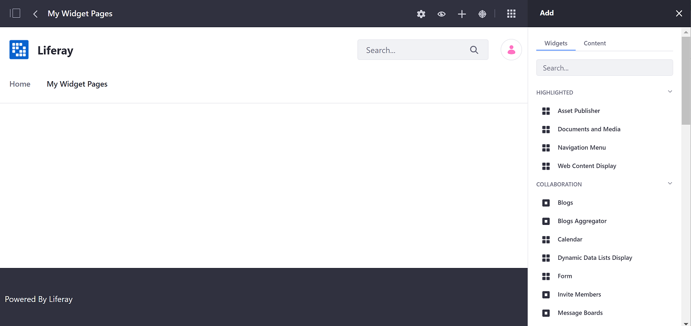

# ページへのウィジェットの追加

次の手順に従って、ウィジェットページにウィジェットを追加します。

1.  コントロールメニューの[ *追加* ]ボタン（）をクリックします。

    

2.  *Widgets* パネルを開き、必要なウィジェットが見つかるまで利用可能なウィジェットのカテゴリを参照するか、ウィジェットを名前で検索できます。

3.  ウィジェットを、配置するページレイアウトの列と行にドラッグします。

ウィジェットは、WikiディスプレイまたはAsset Publisherのような動的パブリッシングツールです。 ウィジェットを使用して表示するコンテンツは、長文のテキストや画像ギャラリーなど、その中間のものにすることができます。

``` note::
  Portlets are rendered according to `render-weight <https://docs.liferay.com/ce/portal/7.3-latest/definitions/liferay-portlet-app_7_3_0.dtd.html#render-weight>`_ on Widget Pages.
```
