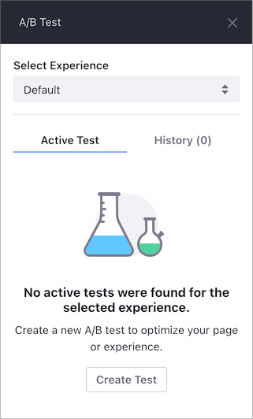

# A/Bテストの作成

A/Bテストを作成する前に、次の点に留意してください。

- デフォルトのエクスペリエンスまたはセグメントにマップされたパーソナライズされたエクスペリエンスのテストを作成できます。
- A/Bテストは、一度に1つのページまたはエクスペリエンスに対してのみ作成できます。
- 実行中のA/Bテストの一部であるエクスペリエンスを編集することはできません。
- アクティブなA/Bテストがすでに実行されているエクスペリエンスに対しテストを作成することはできません。
- A/Bテストの一部であるコンテンツページまたはエクスペリエンスを削除すると、テストも削除されます。
- [テストを実行](./running-and-monitoring-ab-tests.md)せずにA/Bテストのサイドパネルを閉じると、テストはドラフトとして保存されます。

   

A/Bテストを作成するには、最初に [テストを作成](#creating-the-test) してから、1つ以上の [テストバリアント](#creating-the-test-variant) を作成します。

```{important}
テストを作成する前に、A/Bテストの環境が[要件を満たしている](./verifying-ab-test-requirements.md)ことを確認してください。
```

<a name="creating-the-test" />

## テストの作成

1. テストするコンテントページに移動します。
1. コントロールメニューで、 ［**A/Bテスト**］（）をクリックします。
1. コンテントページに他のエクスペリエンスがある場合は、テストするエクスペリエンスを選択します。

   

1. ［**テストを作成**］ をクリックします。
1. ［**Test Name**］ を入力し、オプションで ［**Description**］ を入力します。
1. テストで追跡する目標を選択します。

   - **直帰率** ：訪問したがアクティビティ（**クリック** や **スクロール** など）を示さず、別のページにアクセスせずに去った人の割合。
   - **クリック** ：セッションごとのページをクリックした人の割合。

1. ［**Save**］ をクリックして、テストを **下書き** として保存します（訪問者にはまだ表示されません）。

    ```{note}
    A/Bテスト名の横にある*アクション*ボタンをクリックすると、いつでも新しいA/Bテストを編集または削除できます。 削除されたテストは復元できません（つまり、ゴミ箱に送信されません）。 これらのオプションは、アクティブな実行中のテストでは使用できません。
    ```

<a name="creating-the-test-variant" />

## テストバリアントの作成

テストバリアントは、A/Bテストで最適化するエクスペリエンスをカスタマイズしたものです。 各A/Bテストには、少なくとも1つのバリアントが必要です。

1. コンテンツページのA/Bテストサイドバーパネルを開きます。
1. A/Bテストで **クリック** 目標を選択した場合は、テストする要素も選択する必要があります。
    1. ［**有効なテスト**］ タブの ［**目標をクリック**］ セクションで、 ［**Select Clickable Element**］ をクリックします。

         - **クリック** 目標の要素IDを使用して、リンク、ボタン、および入力フィールドをターゲットに設定できます。
         - テストする要素の **要素ID** を入力することもできます。
         - 選択したページ要素を強調表示するには、プレビュー（）アイコンをクリックします。
         - [テストの実行](./running-and-monitoring-ab-tests.md)中は、 ［**Change Clickable Element**］ ボタンは使用できず、 **要素ID** は変更できません。

            

    1. コンテントページでテストする要素をクリックします。
    1. ［**要素をクリック対象に設定**］ をクリックします。

        

         ```{note}
         クリック対象要素はA/Bテスト全体に適用され、すべてのバリアントに存在する必要があります。
         ```

1. ［**バリアント**］ セクションで、 ［**バリエーションを作成**］ をクリックします。
1. バリアントの名前を入力し、 ［**保存**］ をクリックします。
1. バリアント名の横にある ［**編集**］（）ボタンをクリックします。 現在のコンテンツページがバリアントのベースラインとして編集モードで開きます。

1. テストする変更を加えてバリアントを編集します。 たとえば、別のCTAテキストをテストする場合は、ボタンを新しいテキストで更新します。
1. ［**バリエーションを保存**］ をクリックします。

テストとテストバリアントを作成した後、 [テストを実行](./running-and-monitoring-ab-tests) できます。

<a name="related-information" />

## 関連情報

- [A/Bテストの実行と監視](./running-and-monitoring-ab-tests)
- [A/Bテスト](./ab-testing.md)
- [A/Bテスト結果のレビューとテストバリアントの公開](./reviewing-ab-test-results-and-publishing-test-variants.md)
