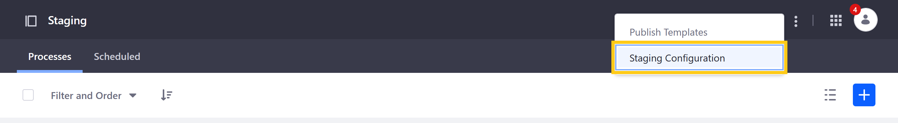

# リモート本番環境ステージングの設定

*リモート本番環境ステージング*では、ステージング環境と本番環境は別々のLiferayサーバーでホストされます。 有効にすると、ステージングの構成に使用されるサイトがステージング環境になり、構成されたリモートサーバーが本番環境になります。

リモート本番環境ステージングを有効にする前に、ステージング環境とライブ環境で使用するLiferayサーバーを構成する必要があります。 また、リモートサーバー上に新しいブランクサイトを作成し、ステージング設定時にそのIDを使用する必要があります。 コントロールパネルの*[Sites Page]* でサイト名を選択すると、任意のサイトのIDを見つけることができます。

  - [Liferayサーバーの準備](#preparing-your-liferay-servers)
  - [リモート本番環境ステージングの設定](#setting-up-remote-live-staging)
  - [リモート本番環境ステージングの権限設定](#remote-live-staging-permissions)
  - [リモートステージングのバッファサイズの設定](#configuring-remote-stagings-buffer-size)
  - [リモート本番環境ステージングの無効化](#disabling-remote-live-staging)

## Liferayサーバーの準備

まだ行っていない場合は、次の手順に従って、Liferayサーバーをリモート本番環境ステージング用に構成します。

1.  両方のLiferayサーバーの`portal-ext.properties`ファイルに次のプロパティを追加して、サーバーの共有認証キーを指定します。
   
        tunneling.servlet.shared.secret=[secret]
        tunneling.servlet.shared.secret.hex=[value]

    各プロパティ値は、選択した暗号化アルゴリズムと、16進エンコーディング（推奨）または印刷可能なASCII文字（安全性が低い）のどちらを使用するかによって異なります。 16進エンコーディングを使用しない場合は、`tunneling.servlet.shared.secret`の値がASCIIに準拠している必要があります。

    使用可能な暗号化アルゴリズムでは、次のキー長がサポートされています。

    **AES**：128、192、および256ビットキー

    **Blowfish**：32～448ビットキー

    **DESede（トリプルDES）**：112または168ビットキー。 Liferayの最小キー長は、56ビットキーをサポートしていません。 <!--Does this limit apply to Blowfish?-->

2.  各サーバーの`portal-ext.properties`ファイルに次のプロパティを追加して、各サーバーを他の許可されたサーバーのリストに追加します。
   
        tunnel.servlet.hosts.allowed=127.0.0.1,SERVER_IP,[OTHER_SERVER_IP]

    サーバーに複数のIPアドレスがある場合は、各IPアドレスも追加する必要があります。

    ```{important}
    If you're validating IPv6 addresses, you must configure the app server's JVM to not force the usage of IPv4 addresses. For example, if you're using Tomcat, add the `-Djava.net.preferIPv4Stack=false` attribute in the `$TOMCAT_HOME\bin\setenv.[bat|sh]` file.
    ```

3.  リモートインスタンスの*トンネル認証検証設定*を更新します。

    これを行うには、*[コントロールパネル]* → *[設定]* → *[システム設定]* → *[API 認証]* → *[トンネル認証]* に移動します。

    */api/liferay/do*をクリックし、使用している追加のIPアドレスを*[許可されたホスト]* フィールドに挿入します。 完了したら、*[アップデート]* をクリックします。

    

    ```{note}
    While it is enabled by default, ensure each Liferay server's tunneling servlet [authentication verifier](../../installation-and-upgrades/securing-liferay/securing-web-services/using-authentication-verifiers.md) is enabled.
    ```

    または、次の構成をLiferayインスタンスのOSGiファイルに書き込むこともできます（例 ：`osgi/configs/com.liferay.portal.security.auth.verifier.tunnel.module.configuration.TunnelAuthVerifierConfiguration-default.config`）。

     enabled=true
     hostsAllowed=127.0.0.1,SERVER_IP,[Local server IP address]
     serviceAccessPolicyName=SYSTEM_User_PASSWORD
     urlsIncludes=/api/liferay/do

4.  両方のLiferayサーバーを再起動して、変更を実装します。

再起動すると、両方のサーバーでステージング設定の準備が整います。

```{important}
When applying patches to a remote Staging environment, you must apply them to all your servers. Having servers on different patch levels is not a good practice and can lead to import failures and data corruption. It is essential that all servers are updated to the same patch level to ensure remote staging works correctly.
```

## リモート本番環境ステージングの設定

Liferayサーバーの準備ができたら、次の手順に従ってDXPインスタンスのリモート本番環境ステージングを設定します。

1.  *[プロダクトメニュー]* → *[公開設定]* → *[ステージング]* に移動します。

    ![プロダクトメニューの[ステージング]に移動します。](./configuring-remote-live-staging/images/01.jpg)

2.  *[リモート本番環境]* を選択すると、*[リモート本番環境への接続設定]*、*[ページバージョニング]*、および*[ステージコンテンツ]* の追加フィールドが表示されます。

    ![[リモート本番環境ステージング]を選択します。](./configuring-remote-live-staging/images/02.png)

3.  次のフィールドを使用して、リモートDXPインスタンスの情報を入力します。

    **リモートホスト/IP**：リモートサーバーのIPアドレスを*[リモートホスト/IP]* フィールドに入力します。 これは、`portal-ext.properties`ファイルで指定した`tunnel.servlet.hosts.allowed`プロパティと一致する必要があります。

    **リモートポート**：リモートDXPインスタンスのポートを*[リモートポート]* フィールドに入力します。

    **リモートパスコンテクスト**：*リモートパスコンテクスト*を入力します。 これは、ルート以外のポータルサーブレットコンテクストパスがリモートLiferayサーバーで使用されている場合にのみ必要です。 このコンテキストへのアクセスは、プロキシまたはファイアウォールによってブロックされてはなりません。

    **リモートサイトID**：リモートLiferay DXPインスタンスの*サイトID*を入力します。

    ![[リモート本番環境への接続設定]フィールドを使用して、リモートDXPインスタンスの情報を入力します](./configuring-remote-live-staging/images/03.png)

    ```{note}
    If you're configuring an IPv6 address, it must contain brackets when entered into the *Remote Host/IP* field (e.g., [0:0:0:0:0:0:0:1]).

    If the Remote server is a cluster, you can set the Remote Host/IP to the cluster's load balanced IP address to increase the availability of the publishing process. See the [Configuring Remote Staging in a Clustered Environment](https://help.liferay.com/hc/en-us/articles/360018175251-Configuring-Remote-Staging-in-a-Clustered-Environment) for details.
    ```

4.  ステージングから本番環境にページを公開するために安全なネットワーク接続（つまりHTTPS）を使用するかどうかを選択します。

5.  リモートサイトのURLを手動で定義するかどうかを選択します。

6.  *[ページバージョニング]* をパブリックページまたはプライベートページ、あるいはその両方で有効にするかどうかを選択します。

    

7.  ステージングする*データ*および*コンテンツ*のタイプを選択します。

    

    ```{warning}
    When applications are checked, their data is copied, and it may not be possible to edit them directly on the live Site. When unchecking an application, first make sure that any changes in Staging are published, since they may be lost. See [Managing Data and Content Types in Staging](./managing-data-and-content-types-in-staging.md) for more information.
    ```

8.  *[保存]* をクリックして、ステージングプロセスを開始します。 このプロセスの期間は、サイトのサイズによって異なります。

    ```{note}
    If your attempt to enable Remote Live Staging fails, please verify that you've properly prepared your servers.
    ```

プロセスが完了すると、リモート本番環境ステージングを使用する準備が整います。 ステージング環境の公開機能のナビゲートについては、[Staging UI Reference](./staging-ui-reference.md)を参照してください。

```{warning}
Never clone your Liferay DXP database. Doing this can duplicate important data used by Staging (e.g., UUID), causing the remote publishing process to fail.
```

## リモート本番環境ステージングの権限設定

ユーザーがステージングから本番環境への変更を公開しようとすると、Liferayはユーザーのメールアドレス、スクリーン名、またはユーザーIDをリモートサーバーに渡して権限チェックを実行します。 成功させるためには、公開するユーザーが両方のサーバーで同一の認証情報と権限を持っている必要があります。

ローカルユーザーにステージングから本番環境への変更を公開する権限を与えるには、リモートサーバー上のユーザーに対して同一の権限を持つ同一のユーザーアカウントを作成します。

このプロセスを簡素化するために、LDAPを使用して、選択したユーザーアカウントをローカルサーバーからリモートサーバーにコピーできます。 詳細は、[Connecting to an LDAP Directory](../../../users-and-permissions/connecting-to-a-user-directory/connecting-to-an-ldap-directory.md)を参照してください。

## リモートステージングのバッファサイズの設定

リモート本番環境ステージングを使用していて、大量のコンテンツを公開している場合、このプロセスは遅くなり、大量のネットワークトラフィックが発生する可能性があります。 そのため、Liferay DXPは、1つの大きなデータダンプではなく、データを段階的に転送します。 `portal-ext.properties`ファイルで次のポータルプロパティを設定することにより、データトランザクションのサイズを制御できます。

    staging.remote.transfer.buffer.size

このプロパティは、リモートステージングのファイルブロックサイズを設定します。 リモートステージングに使用されるLARファイルがこのサイズを超える場合、ファイルは送信前に複数のファイルに分割されてから、リモートサーバーで再構築されます。 デフォルトのバッファサイズは10メガバイトです。

## リモート本番環境ステージングの無効化

1.  *[公開設定]* → *[ステージング]* に移動します。これは、ステージング環境からのみ使用できます。

2.  *[アプリケーション]* バーにある*アクション*ボタン（）をクリックし、*[ステージング設定]* を選択します。

3.  ステージング設定に*[None]* を選択し、*[保存]* をクリックします。

リモート本番環境ステージングを無効にすると、データを削除することなく環境間の接続が無効になります。 データが消去されたり、プロセスが開始されたりすることはないため、リモート本番環境ステージングの無効化はほぼ瞬時に行われます。

リモートステージングを無効にする場合は、本番環境サイトに引き続きアクセスできることを確認して、双方が無効になったことを通知できるようにする必要があります。 本番環境サイトをシャットダウンしてから、ステージングされたサイトからリモートステージングを無効にすることはしないでください。 環境間でネットワーク接続が失われた場合は、エラーメッセージが表示され、ステージングを強制的に無効にするように指示されます。

ステージングを強制的に無効にすると、コンテンツではなく、ステージングサーバーからステージング情報が消去されます。 本番環境サイトはロックされた状態のままになります。 回避策としては、新しい本番環境サイトを作成し、必要に応じてそこにコンテンツをインポートします。

## 追加情報

  - [Staging Overview](../staging.md)
  - [Staging UI Reference](./staging-ui-reference.md)
  - [ステージング権限の管理](./managing-staging-permissions.md)
  - [ステージングでのデータとコンテンツタイプの管理](./managing-data-and-content-types-in-staging.md)
