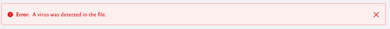

# アップロードされたファイルのウイルス対策スキャンを有効にする

> 変更通知を受け取り（購読）が必要

Liferayにアップロードされたファイルを自動的にスキャンしてウイルスを検出できます。 ウイルス対策スキャナーを有効にすると、[ドキュメントとメディア](../../content-authoring-and-management/documents-and-media/introduction-to-documents-and-media.md)、[掲示板](../../collaboration-and-social/message-boards/user-guide/getting-started-with-message-boards.md)などのLiferayアプリケーションへのアップロード時にファイルがチェックされます。 ウイルスが見つかった場合は、報告され、ユーザーが拒否できます。


Liferay DXP 7.2 Fix Pack 9+は、別のサーバーで動作する[ClamAV Daemon](https://www.clamav.net/documents/scanning#clamd)（Clamd）と統合します。

```{note}
This integration is not yet available on DXP 7.3.
```

```{note}
Prior to DXP 7.2 Fix Pack 9+, the ClamAV antivirus scanner ran locally. Now DXP delegates antivirus scanning to a separate server.
```

Clamdウイルス対策スキャナーを有効にする方法は次のとおりです。

1.  別のサーバーで、[Clamdを設定・起動します](https://www.clamav.net/documents/scanning#clamd)。

    ```{important}
    Load your ClamAV database before starting Clamd.
    ```

2.  次の[ポータルプロパティ](../file-storage.md)または[Docker環境変数](../../installation-and-upgrades/reference/portal-properties.md)を設定して、[ファイルストア](../../installation-and-upgrades/installing-liferay/using-liferay-docker-images/configuring-containers.md)（ドキュメントライブラリ）のウイルス対策を有効にします。

    ポータルプロパティ：

    ``` properties
    dl.store.antivirus.enabled=true
    ```

    Docker環境変数：

    ``` properties
    -e LIFERAY_DL_PERIOD_STORE_PERIOD_ANTIVIRUS_PERIOD_ENABLED=true
    ```

3.  Liferayサーバーを起動します。

4.  *[コントロールパネル]* → *[システム設定]* に移動し、セキュリティカテゴリで*[Antivirus]* を選択します。

    ![[Antivirus]は、システム設定のセキュリティカテゴリにあります。](./enabling-antivirus-scanning-for-uploaded-files/images/02.png)

5.  メニューで*[Antivirus Clamd Scanner]* を選択します。

    

6.  Clamdサーバーのホスト名またはIPアドレス、ポート、および接続タイムアウト時間（ミリ秒）を入力します。

7.  *[保存]* をクリックします。

これで、Liferayアプリケーションへのアップロード時にファイルがスキャンされます。 アップロードするファイルでウイルスが検出された場合、スキャナーによって感染したファイルが報告されるので、ファイルの保存を却下する必要があります。



```{important}
Never save a virus-infected file. Reject the file by canceling the current operation.
```

## 追加情報

  - [ファイル ストレージ](../file-storage.md)
  - [システム設定](../configuring-liferay/system-settings.md)
