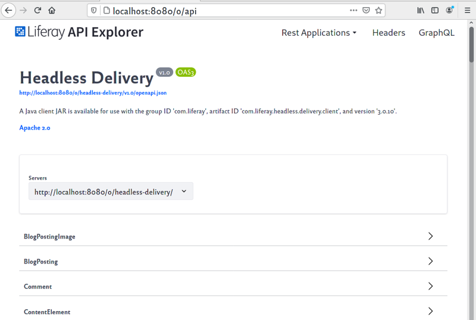
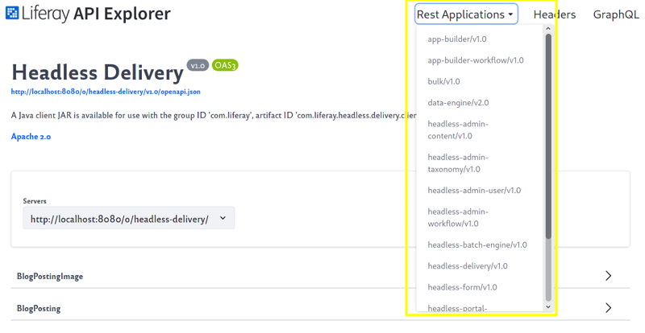
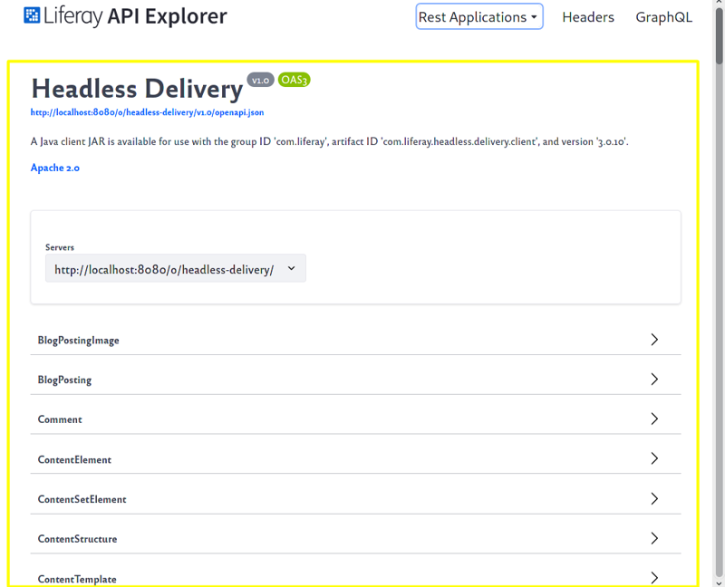
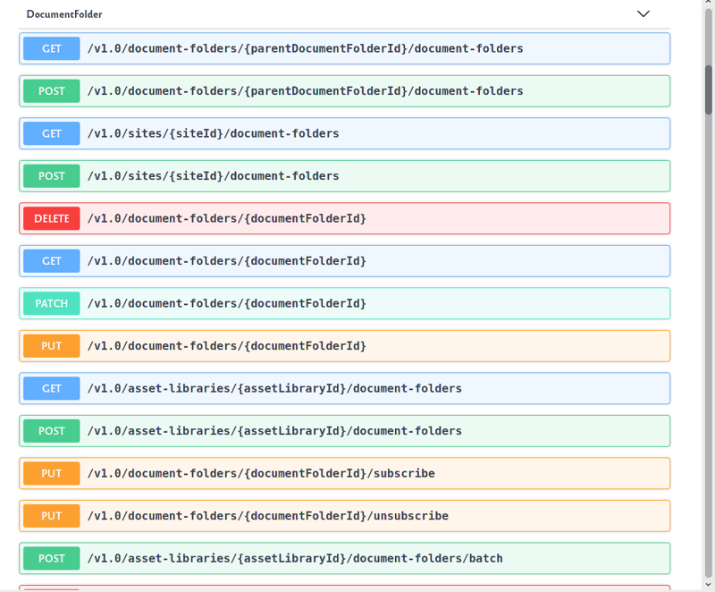
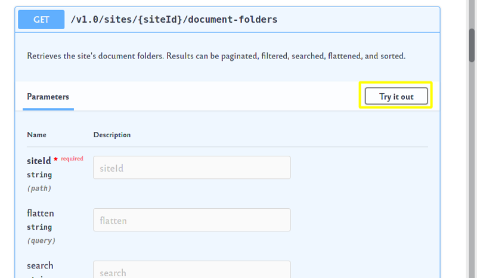
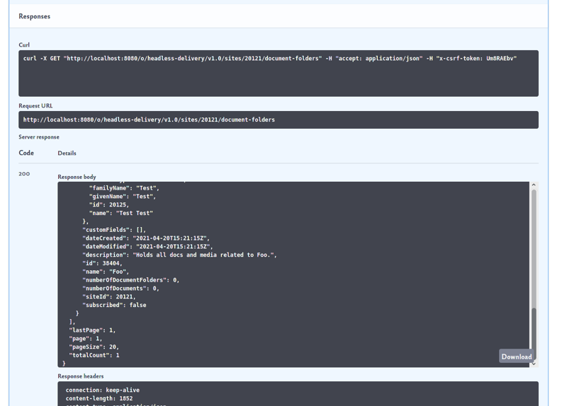

# REST API Project Guidelines

Liferay's REST APIs provide a powerful, easy-to-use way to consume Liferay services. For this reason, we want to demonstrate using a sampling of all Liferay REST APIs.

Here are the things to consider as you're creating REST API client projects. 

* [Exploring the API](#exploring-the-api)
* [Planning projects](#planning-projects)
* [Setting up a project](#setting-up-a-project)
* [Client filename format](#client-filename-format)
* [Opening access to a service](#opening-access-to-a-service)
* [Developing cURL commands](#developing-cURL-commands)
* [Developing Java clients](#developing-java-clients)
    * [Researching resource methods](#researching-resource-methods)
    * [Example: Posting a DocumentFolder](#example-posting-a-documentfolder)
    * [Configuring dependencies](#configuring-dependencies)
    * [Compiling classes](#compiling-classes)
    * [Running classes](#running-classes)
* [Formatting source code](#formatting-source-code)
* [Updating permissions](#updating-permissions)
* [Sending code for review](#sending-code-for-review)
* [Appendix](#appendix)
    * [POST using JSON data](#post-using-json-data)
    * [POST using a multipart document](#post-using-a-multipart-document)
* [Additional information](#additional-information)

Start exploring the REST APIs. 

## Exploring the API

The API Explorer is a UI for browsing Liferay REST APIs and trying them. Here's an example of exploring an API.

1. Sign in to Liferay at http://localhost:8080.

1. Open the API Explorer at http://localhost:8080/o/api. The API Explorer appears.

    

    > **Tip:** Opening the API Explorer in a separate browser tab is convenient for signing back into Liferay if your session times out.

1. View the various REST applications by clicking the *Rest Applications* menu in the top right. The menu lists the available applications.

    

    The headless-delivery/v1.0 application has popular application services for resources, such as BlogPosting, Document, and more. There are applications for user management, forms, app builder, and more. We'll explore DocumentFolder services in the headless-delivery/v1.0 application.

1. Open the Headless Delivery services by clicking on *headless-delivery/v1.0* in the *Rest Applications* menu. The Headless Delivery API page appears.

    
    
    Here's what the application page provides:

    * Link to the application's [`openapi.json` file](https://swagger.io/docs/specification/basic-structure/). This document defines the entire API.
    * Java client artifact JAR information. Your project's Java classes will depend on the REST application's client JAR. This is covered later in [Configuring Dependencies](#configuring-dependencies).
    * Resource listing. The application's resources (e.g., BlogPostingImage, BlogPosting, etc.) are listed in alphabetical order. Each resource has an interface for examining the resource's services and schemas, and an interface for executing the service. 
    * Schema listing. The *Schemas* section, after all the resources, lists each resource schema.

1. In the resource listing, find *DocumentFolder* and click on it. The *DocumentFolder* service listing appears.

    

    Each row has an HTTP command and an endpoint URL. 

    | HTTP Command | Description |
    | :----------- | :---------- |
    | `GET` | Get a resource value or metadata about a resource |
    | `POST` | Create a resource instance |
    | `DELETE` | Remove a resource |
    | `PATCH` | Update parts of a resource |
    | `PUT` | Replace a resource |

1. Click DocumentFolder's *GET /v1.0/sites/{sideId}/document-folders* service. The test interface appears.

    

1. Click *Try it out* and enter your site's ID (for example, `20121`) in the `siteId` field. See [Consuming REST Services](https://learn.liferay.com/dxp/latest/en/headless-delivery/consuming-apis/consuming-rest-services.html#identify-the-site-containing-the-data) for details on finding your site ID.

1. Click *Execute* to invoke the service. The service responses appear in the *Responses* section below the *Execute* button.

    

    The *cURL* field shows the cURL command that was executed.
    
    > **Note:** You can base your cURL commands off of ones like these.

    The service response *Response body* shows the site's DocumentFolder listing. In this example, the site has one DocumentFolder (i.e., `"totalCount": 1`) and the DocumentFolder's name is `Foo`  (i.e., `"name": "Foo"`).

Now that you've explored a resource in the API Explorer, you can explore and plan for demonstrating other Liferay REST APIs.

## Planning Projects

Each REST API has fundamental services and may have other key services. When a user learns the fundamentals and sees a sampling of the services he wants to use, he'll be able to piece together additional service calls. So there's no need to demonstrate *all* of an API's services.

Use separate projects to demonstrate these types of services.

* Fundamental services for a resource include using each HTTP command to demonstrate CRUD operations. (Required)

    For example,

    1. POST a [resource] instance to a site or other common location
    1. GET the [resource] fields
    1. PATCH the [resource] 
    1. PUT another [resource] in its place
    1. DELETE the [resource]

* If your resource has "batch" services, demonstrate a sampling of them. Batch services involve creating or deleting multiple resource instances in one call. They typically involve input formats such as CSV, XLS, or JSON.

* Demonstrate any other key services for the resource.

> **Note:** If there's another resource that's tightly coupled with your main resource (for example DocumentFolder is coupled with Document), consider including that resource's services in your project too. Limit your projects however, to two resource types.

It's time to set up a project.

## Setting Up a Project

REST API client projects are similar to `liferay-learn` Java projects except they don't have Workspace or Gradle. They're built using the `javac` command and executed with the `java` command. Here's how to create a REST API client project:

1. Create random project ID. Use the ID in place of `[xxxx]` in the project folder's name `liferay-[xxxx].zip`. The ID must be unique to the `liferay-learn` branch. You can generate the ID using this command:

    ```bash
    tr -cd a-z1-9 < /dev/urandom \
     | head -c 1000 \
     | sed 's/.*\([a-z]\).*\([1-9]\).*\([a-z]\).*\([1-9]\).*/\1\2\3\4\n/'
    ```

    Check the branch for any existing projects that already use the name. For example,

    ```bash
    find . -name liferay-xxxx.zip
    ````

1. Create a path for your project folder, following this format:

    ``` 
    [area]/developer-guide/api/[tutorial-name]/resources/liferay-[xxxx].zip
    ```

    For example, here is the project path for the *Document API Basics* tutorial:

    [`documents-and-media/developer-guide/document-api-basics/resources/liferay-g9i6.zip`](https://github.com/liferay/liferay-learn/tree/master/docs/dxp/latest/en/content-authoring-and-management/documents-and-media/developer-guide/document-api-basics/resources/liferay-g9i6.zip)

1. In your `liferay-[xxxx].zip` folder, create a `curl` folder for cURL commands and a `java` folder for Java client classes.

Here's the resulting project structure:

```
liferay-[xxxx].zip/
├── curl/
└── java/
```

## Client Filename Format 

The cURL command and Java command files should follow this naming format:

```
[Resource(s)]_[ACTION]_[By|From|To][Something].[java|sh]
```

Here are examples for the [DocumentFolder resources](https://github.com/liferay/liferay-learn/tree/master/docs/dxp/latest/en/content-authoring-and-management/documents-and-media/developer-guide/document-api-basics/resources/liferay-g9i6.zip/curl).

| cURL | Java | Description |
| :--- | :--- | :---------- |
| `DocumentFolder_POST_ToSite.sh` | `DocumentFolder_POST_ToSite.java` | Create the DocumentFolder in the site. |
| `DocumentFolders_GET_FromSite.sh` | `DocumentFolders_GET_FromSite.java` | List a site's DocumentFolders. Note, the resource name is plural. |
| `DocumentFolder_GET_FromId.sh` | `DocumentFolder_GET_FromId.java` | Get a DocumentFolder's fields. |

You'll want to open access to your services too.

## Opening Access to a Service 

For testing purposes, a service can be accessed using basic authentication. The previous example passes in user credentials after the `-u` flag, like this:

```bash
-u "test@liferay.com:test"
```

In case the service is also tied to the session, sign in to Liferay with that user too.

> **Tip:** In addition to a tab for the Liferay API browser, open a separate tab to the Liferay UI so you can sign your user back in if your session times out.

See [Consuming Rest Services](https://learn.liferay.com/dxp/latest/en/headless-delivery/consuming-apis/consuming-rest-services.html#make-the-service-call-using-credentials-with-access-to-the-data) for details on using credentials or see [Making Unauthenticated Requests](https://learn.liferay.com/dxp/latest/en/headless-delivery/consuming-apis/making-unauthenticated-requests.html).

It's time to develop your REST commands. Start with cURL commands.

## Developing cURL Commands 

The API Browser's *Try it out* feature is a great way to see the services in action and to gather information about cURL commands. See the previous section [Exploring the API](#exploring-the-api) for details.

A good service type t    o try first is one that gives you a listing of resource instances for your site (or instances for some other scope). For example, this command lists DocumentFolder instances for a site that has the ID `20121`.

```bash
curl \
	"http://localhost:8080/o/headless-delivery/v1.0/sites/20121/document-folders" \
	-u "test@liferay.com:test"
```

> **Note:** GET commands are implicit--they don't require specifying the GET action.

Organize command arguments alphabetically, starting with upper-case flags and ending with lower-case flags. For example,

```bash
curl \
	-H "Content-Type: application/json" \
	-X POST \
	"http://localhost:8080/o/headless-delivery/v1.0/sites/${1}/document-folders" \
	-d "{\"name\": \"Goo\"}" \
	-u "test@liferay.com:test"
```

| Line | Description |
| :--- | :---------- |
| `curl \` | The cURL command has its own line. |
| *\<tab\>* `-H "..." \` | The upper-case flags and their values are listed first alphabetically. |
| *\<tab\>* `-X POST \` | The HTTP action has its own line. |
| *\<tab\>* `"http://..." \` | The endpoint URL has its own line. |
| *\<tab\>* `-d "..." \` | The lower-case flags and their values are listed alphabetically. |
| *\<tab\>* `-u "..."` | The last line has no backslash. |

Remove non-essential options that you might get from the API Explorer cURL commands. See the Document API Basics [cURL commands](https://github.com/liferay/liferay-learn/tree/master/docs/dxp/latest/en/content-authoring-and-management/documents-and-media/developer-guide/document-api-basics/resources/liferay-g9i6.zip/curl) for examples.

## Developing Java Clients

You must call the REST API using Java too. Each resource (e.g., DocumentFolder, Document BlogPosting, etc.) has a resource class--it ends in `Resource`. For example, `DocumentFolder`'s resource class is `DocumentFolderResource`. The resource class provides the REST API Java methods. Calling the API in Java requires understanding how to initialize the resource, how to invoke the resource methods, and how to use the returned value (if any). Start with learning how to initialize the resource.

### Initializing a Resource

The test case classes in <https://github.com/liferay/liferay-portal/blob/master/modules/apps/headless/headless-delivery/headless-delivery-test/src/testIntegration/java/com/liferay/headless/delivery/resource/v1_0/test/> demonstrate initializing resources and using them.

A test case's `setup` method initializes the resource. For example, the [BaseDocumentFolderResourceTestCase#setup](https://github.com/liferay/liferay-portal/blob/master/modules/apps/headless/headless-delivery/headless-delivery-test/src/testIntegration/java/com/liferay/headless/delivery/resource/v1_0/test/BaseDocumentFolderResourceTestCase.java) method creates a builder and then uses the builder to create a resource instance.

```java 
DocumentFolderResource.Builder builder =
	DocumentFolderResource.builder();

documentFolderResource = builder.authentication(
	"test@liferay.com", "test"
)
```

### Calling Resource Services 

All resources services are represented by Java methods. Examine your resource class Java methods in the [REST API Javadoc](https://docs.liferay.com/dxp/apps/headless/latest/javadocs/). For example, the headless delivery resource Javadoc is at <https://docs.liferay.com/dxp/apps/headless/latest/javadocs/com/liferay/headless/delivery/resource/v1_0/package-summary.html>.

> **Tip:** Search your resource's test case class for calls to the resource methods.

### Example: Posting a DocumentFolder

This client initializes a `DocumentFolder` resource and calls its `postSiteDocumentFolder` method.

```java
import com.liferay.headless.delivery.client.dto.v1_0.DocumentFolder;
import com.liferay.headless.delivery.client.resource.v1_0.DocumentFolderResource;

public class DocumentFolder_POST_ToSite {

	/**
	 * java -classpath .:* -DsiteId=1234 DocumentFolder_POST_ToSite
	 */
	public static void main(String[] args) throws Exception {
		DocumentFolderResource.Builder builder =
			DocumentFolderResource.builder();

		DocumentFolderResource documentFolderResource = builder.authentication(
			"test@liferay.com", "test"
		).build();

		DocumentFolder documentFolder =
			documentFolderResource.postSiteDocumentFolder(
				Long.valueOf(System.getProperty("siteId")),
				new DocumentFolder() {
					{
						name = "Foo";
					}
				});

		System.out.println(documentFolder);
	}

}
```

Here's what it does:

1. Get a `DocumentFolderResource.Builder`.
1. Use the `DocumentFolderResource.Builder` to authenticate a user with a `DocumentFolderResource` instance.
1. Call the `DocumentFolderResource.postSiteDocumentFolder` method, passing in a site ID and a `DocumentFolder` object specified using [JSON](https://www.json.org). The JSON specifies the DocumentFolder schema's required field `name`.

> **Note:** The `main` method's comment demonstrates running the class. It includes a parameter for passing in the site ID.

You must make sure the user can compile and run your client classes from the command line in the project's `java/` folder. The first step is to configure your project's dependencies.

### Configuring Dependencies

Your client's dependencies must be in your `java/` folder for you to test your clients and for packaging in the in the `liferay-[xxxx].zip` file at site build time. You'll set up your dependencies using a `liferay-[xxxx].zip/../resources/update_example.sh` script.

Example [`update_example.sh`](https://github.com/liferay/liferay-learn/blob/master/docs/dxp/latest/en/content-authoring-and-management/documents-and-media/developer-guide/document-api-basics/resources/update_example.sh):

```bash
#!/bin/bash

source $(git rev-parse --show-toplevel)/_common.sh

download_nexus_jar "com.liferay.headless.delivery.client"
```

The script above calls the `liferay-learn/_common.sh#download_nexus_jar` function to download the headless delivery REST application client JAR from Liferay's Nexus repository to the current project's `java/` folder.

Create an `update_example.sh` script:

1. Create a script at `resources/update_example.sh`.
1. Copy the content above into your script.
1. Replace `"com.liferay.headless.delivery.client"` with the name of the REST API client JAR your services require.

    > **Note:** Your REST application's page in *API Explorer* mentions the client artifact JAR.

1. On a command line, go to `liferay-learn/docs` and initialize your API project by running the `update_examples.sh` script, passing in your project ID. For example,

```bash
./update_examples.sh xxxx
```

The script invokes your `resources/update_example.sh` script which downloads the required JAR to your `liferay-[xxxx].zip/java/` folder.

### Compiling Classes

In your `java/` folder, compile your code using `javac`.

```
javac -cp .:* *.java
```

### Running Classes 

In your `java/` folder, run your Java class, passing in any requried system properties. For example,

```bash 
java -classpath .:* -DsiteId=1234 DocumentFolder_POST_ToSite
```

Once you've executed your class successfully, mention its execution command in a comment above your `main` method. For example, 

```java 
/**
 * java -classpath .:* -DsiteId=1234 DocumentFolder_POST_ToSite
 */
public static void main(String[] args) throws Exception {
```

In the comment, use `1234` in place of any required ID value. If there are multiple ID values, continue with `5678`.

## Formatting Source Code 

Our Source Formatter reports formatting issues and automatically fixes many of them. The `liferay-learn/docs/update_examples.sh` script runs the Source Formatter. You can run the script on all examples or on a single project. To run the script on your project, execute the command below, replacing `xxxx` with your project ID.

```bash
cd liferay-learn/docs
```

```bash
./update_examples.sh xxxx
```

Resolve any reported formatting issues and commit your modified files.

## Updating Permissions

Open execute permissions on your cURL scripts by running the `liferay-learn/docs/update_permissions.sh` script. To run the script on your project, execute the command below, replacing `xxxx` with your project ID.

```bash
cd liferay-learn/docs
```

```bash
./update_permissions.sh xxxx
```

## Sending Code For Review 

Branches submitted for code review must only contain code changes--don't include any new/modified articles. 

> **Tip:** Use a dedicated branch (free of any new/modified articles) for your example code. If you have article changes in your branch, back them up (e.g., copy the articles to your Desktop) and then remove them from your branch before sending your branch in a PR.

Send a pull request to `jhinkey` (Jim Hinkey). He will review your code before sending it onward for final review and merging.

Thanks for submitting your REST API example!

## Appendix

### POST Using JSON Data

Here's an example that uses [JSON](https://www.json.org) to post an object to an endpoint.

```bash
curl \
	-H "Content-Type: application/json" \
	-X POST \
	"http://localhost:8080/o/headless-delivery/v1.0/sites/${1}/document-folders" \
	-d "{\"name\": \"Goo\"}" \
	-u "test@liferay.com:test"
```

The `-d "{\"name\": \"Goo\"}"` arguments specify the data--the DocumentFolder name. The header arguments `-H "Content-Type: application/json"` specify the data content uses the JSON format. `${1}` is a placehoder for the user to replace with a site ID. The action arguments `-X POST "http://localhost:8080/o/headless-delivery/v1.0/sites/${1}/document-folders"` specify the POST HTTP command and the endpoint. 

### POST Using a Multipart Document 

Services involving file content must use the [multipart](https://help.liferay.com/hc/en-us/articles/360039026272-Multipart-Requests) form content type. The first part is a file and the other optional part can be any format. For example, this command posts a file to a service:

```bash 
curl \
	-F "file=@Document_POST_ToSite.sh" \
	-H "Content-Type: multipart/form-data" \
	-X POST \
	"http://localhost:8080/o/headless-delivery/v1.0/sites/${1}/documents" \
	-u "test@liferay.com:test"
```

The arguments `-F "file=@Document_POST_ToSite.sh"` specify the file. The header arguments `-H "Content-Type: multipart/form-data"` specify that the content is multipart form data. And the action arguments `-X POST "http://localhost:8080/o/headless-delivery/v1.0/sites/${1}/documents"` specify the POST HTTP command and the endpoint. Once again `${1}` is a placeholder for the user to fill in with a site ID.

## Additional Information

* [Consuming REST Services](https://learn.liferay.com/dxp/latest/en/headless-delivery/consuming-apis/consuming-rest-services.html)
* [Making Unauthenticated Requests](https://learn.liferay.com/dxp/latest/en/headless-delivery/consuming-apis/making-unauthenticated-requests.html)
* [API Headers Reference](https://learn.liferay.com/dxp/latest/en/headless-delivery/consuming-apis/api-headers-reference.html)
* [Multipart Requests](https://help.liferay.com/hc/en-us/articles/360039026272-Multipart-Requests)