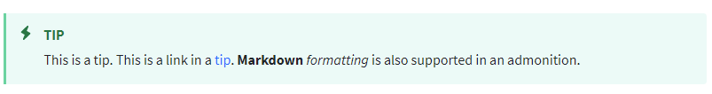

# Documentation Standards

## Documentation Values

Our mission is to satisfy the real world needs of Liferay's users and customers by providing accessible, concise, and cohesive documentation for Liferay's product.

| Value | Article Attributes
| --- | --- |
| **Accessible** | <ul><li>Articles quickly demonstrate the real-world value of a feature or customization </li><li>Articles are organized in ways that correspond to solving a user's goals</li><li>Articles are easily skimmed, digested, and optimized through usage of tables, visuals, and other methods</li><li>Articles maintain a neutral tone and language that can be easily understood cross-culturally</li></ul> |
| **Concise** | <ul><li>Articles get to the point quickly with minimal distractions</li><li>Articles omit needless words and respect reader's time</li></ul> |
| **Cohesive** | <ul><li>Articles regularly answer the question, "How does this relate to the rest of Liferay's other features or products?"</li><li>Articles present features in a way that highlights the strength of the platform and its complementary features</li><li>Article organization shows complementary features and demonstrates an understanding of user needs</li></ul> |

## Formatting Standards

### Line Breaks

Paragraphs are on a single line of text; use dynamic word wrap and do not break at 80 columns. Separate your paragraphs by using two carriage returns.

```
This is a paragraph.

This is another paragraph.
```

### Folder Names

Because documentation is published on a static site, folder names become part of the URL. For this reason, please use appropriately named folders.

`docs/dxp/latest/en/site-building/site-appearance/site-appearance.md`

### Numbered Lists

Single/double space; number all with 1. Multiple paragraphs must be indented to where the first paragraph starts.

```
1. This is a numbered list.

1. This is the second item in a numbered list.

1. This is the third item in a numbered list.

   This is another line for the third item, in case the item takes up multiple paragraphs.
```

### Tables

```
| header 1 | header 2 | header 3 |
| --- | --- | --- |
| cell 1 | cell 2 | cell 3 |
```

| header 1 | header 2 | header 3 |
| --- | --- | --- |
| cell 1 | cell 2 | cell 3 |

### Bold

Bold is used sparingly in the documentation, because too much bold is distracting. The reader's eye is drawn to bold text more than to anything else. All the headings are bold, so we don't want to use it very much in the body text itself. There is one place where we use bold: field Lists.

When explaining a form that users can fill out, use bold for the field names.

**Example:**

**Name:** Enter the user's name.

**Address:** Enter the user's address.

Never end a section with a list of form elements. 

### Italics

Italics are used in more places than bold. Below are some guidelines for when to use italics.

#### **Introducing Concepts**

If you're introducing a concept, italicize the concept the first time you use it. Don't italicize the concept after that. 

**Example:** Liferay Portal/DXP is comprised of many OSGi _modules_. A module is a piece of functionality that can be a self-contained application or an extension to existing functionality. 

Notice the italics on _modules_ the first time it's used, but none when it's used after its initial introduction.

#### **UI Elements**

When you tell the user to click on something in the UI, italicize it.

**Example:** Click the _Save_ button to continue.

If you're referring to a UI element, but there's no direction for the user, capitalize it, but _don't_ italicize it.

**Example:** After clicking the button, the Configuration page appears.

To provide as much clarity on UI elements as possible, combine the above two rules:

**Example:** On the Configuration page, click the _Add_ button.

The UI element that contains direction for the user is italicized, but the UI element that has no direction is not.

## Terminology Standards

It's hard to keep terminology consistent, so when we find an inconsistency in the way a term is used, we must fix it. If you see terminology in a document and you or your spell checker are in doubt, please look it up.

### Common Examples

| Wrong | Right |
| --- | --- |
| backend | back-end |
| frontend | front-end |
| Javascript (or JS or js) | JavaScript |
| ServiceBuilder | Service Builder |
| RESTBuilder | REST Builder |
| openapi | OpenAPI |
| reindex | re-index |
| [LIFERAY_HOME] | [Liferay Home] |
| Out of the box | Out-of-the-box |

### Liferay-specific Examples

Liferay has its own terminology, some of which is fairly common terminology that refers to Liferay-centric concepts. To differentiate the general use of these terms from the Liferay-specific use, we capitalize these terms when we refer to the Liferay-specific variant.

* Site
  * Generic: Liferay provides some great tools for designing your site.
  * Specific: To create a Site, click _Sites_ -> _New Site_.
* Organization
  * Generic: Liferay DXP is flexible enough to be a good fit for any organization.
  * Specific: Liferay Organizations can model the hierarchical structure of any real-world organization.
* Role
   * Generic: Liferay DXP/Portal plays a role in security and authentication. 
   * Specific: Assign the Administrator Role to grant access to the entire system. 
* User
   * Generic: Analytics Cloud can profile many different types of users. 
   * Specific: Create a User account and assign it to a Role. 

### Exclusive Features

Liferay periodically has features that are exclusively available to paid subscribers. Articles that cover these features should be labeled like this:

```
> Subscription Required
```

See [LRDOCS-8821](https://issues.liferay.com/browse/LRDOCS-8821) for future planned improvements.

## Phraseology Standards

The Strunk and White (_Elements of Style_) Rule 13 states _Omit Needless Words_. This principle underlies our approach to phraseology.

### Future Tense

Remove all future tense from the documentation. It's highly unlikely you need it to describe anything. 

_This action will create a new record in the database._

This sentence uses the future tense when there's no need to use the future tense. Instead, use the present tense:

_This action creates a new record in the database._

### Must

_Must_ is always shorter than any equivalent. 

_To use Assets, you need to have an Asset Renderer and an Asset Renderer Factory._

One word is better than two, and since “need to” is two words and “must” is only one, change this to _must_ in all cases.

* To use Assets, you must have an Asset Renderer and an Asset Renderer Factory.

### Dangling Participles

_Please do the following:_

This is a “dangling participle,” because there’s no object following the following. Instead, use phrases like this:

* Follow these steps:
* Do these things:

There's almost always a better construction than "the following." 

### Subject/Object Agreement

_When a user performs this function, they get feedback._

“User” is singular; “they” is plural. In English, this is incorrect, though it’s becoming more common. There’s an easy way to resolve this in most cases. Make the whole thing plural:

* When users perform this function, they get feedback.

Other solutions to this problem are to alternate the singular form between the male and female pronouns:

* When a user performs this function, she gets feedback.
* When a user performs this function, he gets feedback.

### Colons

Proper use of colons dictates they be placed only where you could place a period. That’s right: you must have a complete, independent clause to use a colon correctly. This means these usages are all wrong:

_To use an accelerator:_

_To create a Site:_

_For example:_

In the above examples, you’d use a comma instead of a colon.

### Replace Wordy Clauses<sup>1</sup>

Here’s a list of common wordy clauses people use and their shorter replacements. Again, this is an attempt to apply Rule 13 (Omit Needless Words).

* whether or not = use whether by itself. You only need _or not_ if you mean “regardless of whether”
* in actual fact = remove or use actually
* at the time that; at the time when = when
* in the affirmative; in the negative = yes and no
* at the present time; at this time; at present = now, today, currently
* due to the fact that = because
* inasmuch as = because or since
* in excess of = more than or over
* in regard to = about, regarding, concerning
* literally = means actually; only use as an intensifier
* presently = now or soon
* previous to = before
* prior to = before or until
* question whether; question of whether; question as to whether = use the first
* in the process of = remove
* subsequently = later
* subsequent to = after
* simply = remove
* just = remove
* take a look = look
* basic; basically; general; generally = remove
* allow you to = lets you
* directs you to = shows you
* have the option of = can
* a majority of = most
* a number of = many
* accounted for by the fact that = because
* as a consequence of = because
* due to the fact that = because
* in view of the fact that = because
* for the reason that = because
* on account of = because
* on the basis of = because
* on the grounds that = because
* owing to the fact that = because
* an order of magnitude = ten times
* are of the same opinion = agree
* by means of = by, with
* despite the fact that = although
* during the course of = during, while
* fewer in number = fewer
* for the purpose of = for
* has the capability of = can
* having regard to = about
* if conditions are such that = if
* in all cases = always; invariably
* in close proximity to = near
* in connection with = about, concerning
* in order to = to
* in the event that = if
* it is clear that = clearly
* it is often the case that = often
* it is worth pointing out that = note that
* it may, however, be noted that = but
* lacked the ability to = could not
* large numbers of = many
* prior to = before
* inside of = in
* you’ll need to = you must
* allows you to = lets you

    1[https://www.extension.harvard.edu/inside-extension/cut-clutter-17-phrases-omit-your-writing-today](https://www.extension.harvard.edu/inside-extension/cut-clutter-17-phrases-omit-your-writing-today) and [http://www.academicpeds.org/espauthoring/page_05.htm](http://www.academicpeds.org/espauthoring/page_05.htm)

## Editing Standards

Use the text editor that works best for you. Various members and former members of the team use these editors (in alphabetical order):

* Atom
* Neovim/Vim
* Sublime Text
* Textmate
* Visual Studio Code (VS Code)

Make sure your editor can perform these functions:

* Syntax highlighting, not only of Markdown, but also of the various programming languages used by Liferay (Java, JavaScript, Freemarker, Groovy/Gradle, XML, JSON, etc.).
* Automatic spell check. If a word is highlighted automatically by your spell checker, you’re more likely to catch the error.
* Dynamic word wrapping. You must be able to turn this off to format tables and then turn it back on to go back to paragraphs.

If you are new and unsure of which editor to use, see anybody: the whole team loves to evangelize their particular editor.

## Standards of Voice

Though we have many Tech Writers, it's important that the documentation sounds as if there is only one. For this reason, we have standards of voice, where we attempt to write the documentation in such a way as to make the "voice" of the documentation sound consistent throughout all the articles. The standards below are how we make this happen. 

### Meta-Information

We never talk about meta-information. For example, never say things like this:

_This article is intended to…_

_This series of tutorials walks you…_

_At Liferay, we…_

This is all filler and unnecessary. Keep pronouns strictly to _you_ and don’t mention articles, their sections, or their format. This is meta-information that's unnecessary. 

### Cross Links

When linking from one article to another, keep in mind the rule above (avoid meta information), even in links. For example, this is a bad link:

For more information see <span style="text-decoration:underline;">this article</span>.

This is a good link:

For more information, see <span style="text-decoration:underline;">Friendly URLs</span>.

### Definitions

Definitions are paragraphs, with the item to be defined appearing in bold along with the colon. They should never be bulleted. Here are two example definitions:

**Definition:** A statement that describes the meaning of a term.

**Term:** An object, usually a noun, whose meaning must be defined.

Definitions must never use the term they’re defining in the definition.

### Never Project Roles

Organizations are different. Workflows are different. Roles are different. Never project a role onto your reader when “you” should suffice. For example, never do this:

_Administrators can create the directory..._

_Marketers can use Fragments...._

_Developers should create a class…_

Instead, do this:

_Create the folder…_

_You can use Fragments…_

_Create a class…_

Note that you also [Omit Needless Words](#phraseology-standards) by doing this.

### Address the Reader with “You”

In training, it’s okay to say “we” are working on a particular topic, because there’s a teacher and everybody is learning together. In documentation, don’t address the reader with “we.” Be consistent and always use “you.”

Similarly, don’t say “let’s [do something].”

### Software is Not in Control

Never word things in a way where the software is making the decisions or seems to be in control of the user. Always empower the user. For example, never say this:

_This feature lets you…_

_A dialog pops up that allows you to…_

Instead, put the user in control, not the software:

_You can…_

_Use the dialog to configure…_

### Image Alt Text

Every image should have alt text, and it should be at least one descriptive, complete sentence. In other words, alt text comprised of simple labels isn't enough. DON'T do this for alt text:

_The Liferay setup wizard._

Instead, do this: 

_The Liferay setup wizard makes connecting to your database and configuring a default administrator easy._

The visually impaired use screen readers to read the documentation, and they need good descriptions of whatever you're illustrating with your image.

### Assume the Reader Has Read Nothing Else

Each article should be as standalone as possible. Never assume the reader has (or might have) read another article on the same topic. If it’s helpful to link to another article, definitely do it, but avoid language like this:

_You may have noticed this thing when [doing this other thing in this other article]. Here’s how it works._

Instead, do this:

_At the bottom of the [form](link) is this other function. Here’s how to use it._

## Markdown Syntax Standards

### Spaces / Tabs

Use spaces, not tabs. This is the opposite of the Liferay code standard, but indenting in Markdown is much more effective with spaces than with tabs. 

### Formatting Text

```
**Bold**
```

```
_Italics_
```

### Aside / Admonition Syntax

Use admonitions to capture the reader’s attention. Admonitions stand out from the main body of text to capture the reader’s attention on something important.

**Do not** overuse admonitions. If admonitions occur too frequently, readers skip over them.

The admonitions that we use most frequently are `Tip`, `Warning`, `Note`, and `Important`.

#### Usage

Here is an example of an admonition:

````
```{tip}
This is a tip. This is a link in a [tip](https://www.liferay.com). Markdown formatting is also supported in an admonition.
```
````

Results in:



To learn more about admonition syntax see the [MyST Syntax Guide](https://myst-parser.readthedocs.io/en/latest/syntax/syntax.html).

## Comparing Features

When comparing features between items, such as Public and Private Pages, use a table with checks:

```
| Behavior | Public Pages | Private Pages |
| --- | --- |---|
| Visible to unauthenticated users | &#10004; |  |
| Viewing requires Login and Site Membership |  | &#10004; |
| Distinct URL pattern | &#10004; | &#10004; |
```

Results in:

| Behavior | Public Pages | Private Pages |
| --- | --- |---|
| Visible to unauthenticated users | &#10004; |  |
| Viewing requires Login and Site Membership |  | &#10004; |
| Distinct URL pattern | &#10004; | &#10004; |

## Images

For images that are reused across multiple articles (like icons), there is a shared images folder in the root of each product's documentation section.

* [DXP](https://github.com/liferay/liferay-learn/tree/master/docs/dxp/latest/en/images)
* DXP Cloud
* Analytics Cloud
* [Commerce](https://github.com/liferay/liferay-learn/tree/master/docs/commerce/latest/en/images)

Use one of these prefixes as a naming convention:

* `icon-`
* `button-`
* `menu-`

### Image Quality / Capture

Capture icon images at a resolution of 20x20. Resize screen shots to an appropriate width for the page (no more than 800 pixels wide). Crop out any unnecessary UI elements and focus only on what the text is describing. 

### Image Naming

Images should be named as sequential numbers (01.png, 02.png), etc. 

### Highlighting UI Elements

Highlighting UI elements is a great way to show users how to use a feature. Two ways of highlighting UI elements: Box highlighting and numeric annotations.

An example using box highlighting:

An example of using numeric annotations:


If you use numeric annotations, define what's pictured in the text below the image. 

## Article Naming

Article names (file names) should be the same as the article's title, all in lower case, with dashes replacing the spaces. If, for example, you have an article titled _Using Message Boards_, the article's file name should be `using-message-boards.md`. 

## Videos

When including videos, they must be embedded using HTML tags in your Markdown. Videos go in the `images` folder, with file names numbered in sequential order as images. For example, if you have `01.png`, `02.png`, and `03.png` and the next thing you want to embed is a video, name it `04.mp4`. Be sure to include the controls when embedding videos. Here's an example: 

```html
<video width="100%" height="100%" controls>
    <source src="./organizing-content-with-categories-and-tags/images/10.mp4" type="video/mp4">
</video>
```

## Working with Multiple Software Versions

The goal for Liferay's documentation is to be versionless. Rather than have multiple versions of documentation as in the past, we want to avoid proliferating articles for minor software versions. For this reason, the goal is to cover all versions in the same Markdown file.

Sometimes a feature changes drastically enough that you must include separate instructions to cover several Liferay versions, because the user interface is so different. When doing this, have these goals in mind: 

* Do not create a new article to discuss the changes in a new software minor version. Keep all the content for the same software major version in the same article.
* Place the newest information at the top of the article and the oldest information at the bottom.
* Evaluate the impact of the changes in the existing document:
  * For minor changes, use notes to let readers know which version the content applies to. Markdown example: `> Available: Liferay 7.3+`. If the change requires a header, place the note right after the header.
  * For major changes, use a dedicated H2 section to discuss the changes and place a note-type admonition at the beginning of the topic cross-linking the H2 (see Markdown Examples.)

### Markdown Examples

Example 1: You  must update a product feature discussed in software version 7.2. This feature incorporates new functionality in 7.3, but the rest of the feature works in the same way it works in 7.2. In this case, use notes to signify the changes for the affected version:

```
# Organizing Content with Categories and Tags

## Vocabularies

[content for 7.2 and 7.3+ versions goes here]

### Vocabulary Visibility

> Available: Liferay 7.3+.

[content specific for 7.3 goes here]
```

Example 2: If you must update content that changes significantly between the existing 7.2 and the new 7.3 version, write the content for the most recent version at the top and use an H2 to place the previous content:

````
# About Collections and Collection Pages

```{note}
This information applies to Liferay DXP 7.3+. For previous Liferay DXP versions, see [Liferay DXP 7.2](#liferay-dxp-7.2).
```

[content for 7.3+ version goes here]

## Liferay DXP 7.2

[content for 7.2 version goes here]
````

### Formatting the Previous Content

If you must copy content from Help Center into Learn or add new content in the same topic, consider the following information:

* Newer versions go at the top of the Markdown file, older versions at the bottom.
* Copy the content from the source Markdown file; do not use the source HTML file.
* Create a new H2 containing the Liferay version for the content you're porting or updating at the end of the Markdown file (for example ## Liferay 7.2). H2s are displayed on the right side Table of Contents on all articles, allowing readers to skip quickly to this content.
* Update the header levels for the content you port or update. Because you are using an H2 to group this content, demote all previous H2s to H3, all H3s to H4, and so on.
* Format the content you paste. You may have pasted unexpected line endings or additional spaces between words or paragraphs.
* If porting content from Help Center,
  * Remove any formatting options from the alt text in images. The old Markdown processor could handle formatting options like bold or italics in image alt text. The new Markdown processor doesn't support this, and causes your local build to fail with an error similar to img_node['alt'] = ''.join(content).
  * Copy all the screenshots from the `liferay-docs` folder into the corresponding images folder in Learn. Rename the screenshots to use the Learn naming convention (01.png, 02.png, and so on.)
  * Update all the image links in the Markdown content you're porting, so images display correctly.
* Always create the local Liferay Learn build and ensure that the content you're porting or updating renders as expected.

